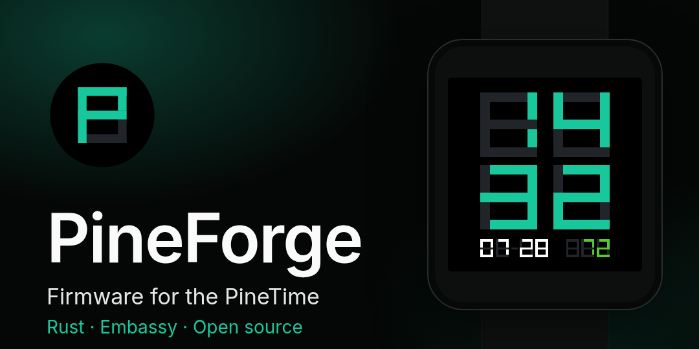

# PineForge - Rust Firmware for PineTime



PineForge is an independent firmware implementation for PineTime, written in
Rust using Embassy. It is not a fork or port of InfiniTime. The project
nevertheless depends heavily on the hardware research, protocol documentation,
tooling, and practical experience produced by the PineTime, InfiniTime,
Gadgetbridge, Embassy, and wider embedded open-source communities.

PineForge intentionally implements compatible hardware interfaces, MCUBoot
update flows, and selected Gadgetbridge-facing protocols. Compatibility does not
imply shared source code.

In parallel, I am working on a dedicated PineForge bootloader based on
`embassy-boot`, with the long-term goal of providing a fully Rust-based and
independently maintained firmware update chain.

It is an independent community project, not affiliated with, supported by, or
maintained by PINE64.

It runs on a **sealed** watch through the existing InfiniTime MCUBoot
bootloader, and has been the firmware on my own watch since late July 2026: it
keeps time, takes notifications, updates over the air and is worn daily. What it
is not is broadly validated - the evidence behind that sentence is one watch,
one bootloader version and one phone. A second sealed unit runs the same image
and boots, and that is the whole of what it establishes. What all this does and
does not establish is under **Safety and recovery model** below, in
[`GETTING-STARTED.md`](GETTING-STARTED.md), and in
[`docs/TESTED-CONFIGURATIONS.md`](docs/TESTED-CONFIGURATIONS.md).

## Project status

The `v0.1.0` milestone established the foundation: a Rust/Embassy firmware that
boots through the InfiniTime MCUBoot bootloader, uses the PineTime hardware, and
performs a Gadgetbridge-compatible OTA update. A complete PineForge-to-InfiniTime
OTA transfer reached 100%, validated, rebooted, and returned to InfiniTime on
real hardware.

`v0.2.0` turns that bring-up into a platform: product policy moved into a
host-tested state crate, the side button became the back button once a software
restart existed to replace it as the recovery path, and BLE pairings survive
reboots and updates. `v0.2.1` follows with a gesture no longer activating the
control under the finger, and static RAM inside its design target - see
[`docs/releases/v0.2.1.md`](docs/releases/v0.2.1.md).

`v0.3.0` completes the navigation shell and puts the first applications on it:
the launcher, a notifications screen, flashlight and pulse, settings split into
a root and a leaf per setting, background heart-rate measurement, selectable
wake gestures, and a watch that says which build it is running - see
[`docs/releases/v0.3.0.md`](docs/releases/v0.3.0.md).

`v0.4.0` is about look and speed: the FORGE watchface became the default and
was finished in its own numerals, so the face carries no font at all; a steps
application shows the day against a goal; notifications moved onto a card and
gained a reading size for their text; and a set of drawing changes made every
screen cheaper to paint - each one measured, several of them the opposite of
what was predicted - see [`docs/releases/v0.4.0.md`](docs/releases/v0.4.0.md).
`v0.5.0` adds music state, transport and volume control in a dedicated
FORGE-style application, plus a three-page system-status view in About. On the
known watch and Gadgetbridge setup, music metadata and all six controls work;
all three status pages have also been flashed and displayed. Music recovery
after sleep, reconnection and media-application switching, uncommon status
failures, and other PineTime variants remain untested - see
[`docs/releases/v0.5.0.md`](docs/releases/v0.5.0.md).
`v0.6.0` adds FORGE-style stopwatch and countdown applications, including a
system alarm that wakes the display and drives a cancellable repeating
vibration. Separate TIME and DATE applications set the wall clock without a
phone and restore CRC-checked checkpoints from external flash after a reboot;
a later valid Gadgetbridge time remains authoritative. All four applications
use cell-level partial rendering and have run on the known watch - see
[`docs/releases/v0.6.0.md`](docs/releases/v0.6.0.md).
`v0.6.1` adds a dedicated Bluetooth application: the radio can be disabled and
enabled on the watch, the choice survives a reboot, and an actually disabled
radio leaves no Bluetooth rune in the status corner.

`v1.0.0` is the release where the watch reports back. Steps and heart rate reach
a companion over the services InfiniTime defines, notifications arrive with the
name of whoever sent them, and weather arrives from the phone as conditions and
a five-day forecast drawn in nine symbols. Behind it the firmware split into
four crates with the boundaries checked in CI, and the RAM budget became a
hardware-measured bound rather than a design target, after twice putting the
stack under what pairing needs - see
[`docs/releases/v1.0.0.md`](docs/releases/v1.0.0.md).

The number reported over Bluetooth is not this one. Gadgetbridge reads the
firmware revision as a capability statement and gates features on it, so the
Device Information Service carries `1.14.0` - the protocol generation this
firmware answers for - while the watch's own About screen shows the PineForge
release. `COMPANION_PROTOCOL_VERSION` in `build.rs` holds the first, and a guard
beside it refuses a number whose behaviour this firmware cannot meet.

[`docs/ROADMAP.md`](docs/ROADMAP.md) records what is done and what is not.

Wearing it myself every day is one watch's worth of evidence, and a second
sealed watch that boots the same image does not turn it into two: neither unit
states its revision, so they may well be the same one. None of it establishes
general safety across PineTime hardware revisions, bootloader versions, phones,
or future images. Expect bugs, slow OTA transfers, and possible recovery work.
[`docs/TESTED-CONFIGURATIONS.md`](docs/TESTED-CONFIGURATIONS.md) records exactly
which setup the evidence comes from and which questions are still open.

Two features are usable but unvalidated: **step counting and heart-rate
measurement** have never been compared against a reference instrument, so the
numbers they show are indicative rather than trustworthy. Both are still being
tested and are likely to change.

## Support expectation

Maintained on a best-effort basis by one person, in the evenings around a day
job. Issues and pull requests are welcome and are answered as fast as that
allows, which is usually quick - an intention, not a commitment. See
[`CONTRIBUTING.md`](CONTRIBUTING.md).

## Safety and recovery model

- New PineForge images initially run as unconfirmed MCUBoot test images.
- The user can confirm a tested image on the watch; OTA is disabled until the
  running image is confirmed, preserving the rollback image.
- Before confirmation, a reset allows MCUBoot to roll back to the previously
  installed image.
- The physical side button provides an explicit reset/rollback path while the
  image remains unconfirmed.
- Holding the side button during boot until the boot logo turns red starts the
  minimal InfiniTime recovery image. Its Bluetooth DFU service can install a
  known-good firmware ZIP even when the normal application cannot boot.
- Keep a known-good official InfiniTime DFU ZIP on the paired phone before
  testing PineForge.

## What it does

On the watch:

- two watchfaces, selectable and remembered across reboots. **FORGE** is the
  default: the time in large numerals drawn from rectangles rather than from a
  font, with the date and the charge under it set in the same numerals, so the
  face carries no font at all. A bolt appears beside the charge while a charger
  is attached. `TERMINAL` is
  the other, one labelled row per reading - time, date, battery and charge
  source, steps, heart rate and Bluetooth state.
- an application launcher, reached by swiping up from the watchface
- notifications from the phone, read one per screen by pulling down from the
  watchface, and dismissed with a swipe
- settings for brightness, dim and display-off timeouts, heart-rate interval,
  wake gesture and watchface, all surviving a reboot
- a flashlight, an on-demand heart-rate reading, and a steps application
  showing the day's count against a goal
- music control for whatever is playing on the phone: the title and artist, the
  elapsed time in the watchface's numerals over a progress bar, and a transport
  of previous, play/pause and next, with volume on the up and down swipes
- a Bluetooth application that enables or disables advertising and active
  connections on the watch; OFF is persistent and removes the status rune
- screens that slide vertically rather than appearing in strips, done by moving
  the panel controller's own display window over frame memory it is not showing,
  so the movement costs one frame instead of one per step
- an unreleased battery application: the charge in the watchface's numerals,
  whether it is charging, charged or discharging, and the cell voltage behind
  the estimate
- an unreleased FORGE-style stopwatch showing minutes, seconds and tenths, with
  start, pause, resume and reset; its monotonic anchor keeps elapsed time across
  display sleep
- an unreleased FORGE-style countdown from 1 to 99 minutes, with pause, resume
  and cancel; reaching zero wakes a full-screen alarm and an approximately
  five-second repeating haptic even when another application is open or the
  display is asleep
- separate unreleased TIME and DATE applications for setting the wall clock
  without a phone. APPLY updates the running clock immediately and journals a
  reboot checkpoint to external flash; the next valid phone time remains
  authoritative and replaces the manual value
- step counting, and heart-rate measurement on a background interval
- a firmware screen for image confirmation and a software restart, and a
  three-page About view naming the build and bootloader, showing sensor and
  flash probe status with the flash JEDEC ID, and collecting image, BLE, stack
  high-water and latest-fault state
- the side button as back; on the watchface it puts the panel out, and held for
  two seconds it resets
- haptic feedback on activation, pairing, and the end of a firmware transfer

Over Bluetooth, with Gadgetbridge:

- passkey pairing, with bonds that survive reboots and updates
- time synchronisation
- firmware updates through the Nordic Legacy DFU service, with progress and
  failure reporting on the watch
- Current Time, Battery and Device Information services
- `InfiniTime`'s music service, which is the one thing the watch uses to talk
  first rather than to answer

Underneath:

- Embassy on the nRF52832, strict `no_std`, no heap and no full-screen
  framebuffer
- ST7789 display, CST816S touch, BMA421 motion, HRS3300 heart rate, XT25F32
  external flash
- product policy in a host-tested crate, and screens that render into any
  surface - both testable on a laptop, see
  [`CONTRIBUTING.md`](CONTRIBUTING.md)
- MCUBoot image confirmation, OTA activation, reset and rollback paths, with the
  stock bootloader and its recovery image left untouched
- watchdog feeding for the WDT the bootloader starts
- flash and static RAM held to budgets enforced in CI

### Pin assignment

Touch is SDA `P0.06`, SCL `P0.07`, reset `P0.10`, interrupt `P0.28`. The rest
live in [`src/board/pins.rs`](src/board/pins.rs).

## Build

`setup-build-tools.sh` installs the Rust components, a pinned MCUBoot checkout
for `imgtool`, and a `.venv` with pinned Python tooling. It is safe to re-run.

```bash
./scripts/setup-build-tools.sh
./scripts/build-dfu.sh
```

`build-dfu.sh` takes the version from `Cargo.toml` when called without an
argument. Pass one to add build metadata that distinguishes two packages of the
same release, for example `./scripts/build-dfu.sh 0.6.0+1`.

The DFU script builds the production profile with normal UI animations by
default. Diagnostic screens and render metrics are opt-in:

```bash
PINEFORGE_FEATURES=diagnostics ./scripts/build-dfu.sh
```

Release artifacts and routine OTA tests must use the default production build
unless the artifact is explicitly labeled as diagnostic.

Output:

```text
dist/pineforge-mcuboot-app-dfu-<version>.zip
```

named after the `version` in `Cargo.toml` - `0.6.0` as this was written.

This ZIP can be installed through the Gadgetbridge firmware installer.

Before flashing, follow
[`GETTING-STARTED.md`](GETTING-STARTED.md) and
[`docs/SEALED-PINETIME-TESTING.md`](docs/SEALED-PINETIME-TESTING.md).

## References and acknowledgements

PineForge was written as a new codebase. It does not copy any of these projects' architecture wholesale, but their practical PineTime work informed hardware bring-up and the organization of this firmware:

- [`InfiniTimeOrg/InfiniTime`](https://github.com/InfiniTimeOrg/InfiniTime) - the largest debt in this list. The Bluetooth services PineForge answers on are InfiniTime's: its music, motion and Simple Weather services, the header its notifications carry, and the Device Information strings a companion recognizes the watch by. Its hardware work settled bring-up details this firmware would otherwise have had to find the hard way, among them the TWIM clock the nRF52832 needs on this board rather than an exact 400 kHz, the bus recovery pulses before touch initialization, and the trailer word that marks an image confirmed. Compatible interfaces, not shared source.
- [`InfiniTimeOrg/pinetime-mcuboot-bootloader`](https://github.com/InfiniTimeOrg/pinetime-mcuboot-bootloader) - the bootloader memory layout, DFU format, trial boot, and rollback behavior targeted by PineForge.
- [`dbrgn/pinetime-rtic`](https://github.com/dbrgn/pinetime-rtic) - PineTime pin assignments and proven display initialization details.
- [`thecodechemist99/pinetime-rust`](https://github.com/thecodechemist99/pinetime-rust) - prior art for modular Rust peripheral drivers and asynchronous task organization.
- [`embassy-rs/embassy`](https://github.com/embassy-rs/embassy) - the modern asynchronous embedded Rust runtime used by PineForge.

Thanks to these projects and the wider PineTime community for documenting and testing the hardware.
